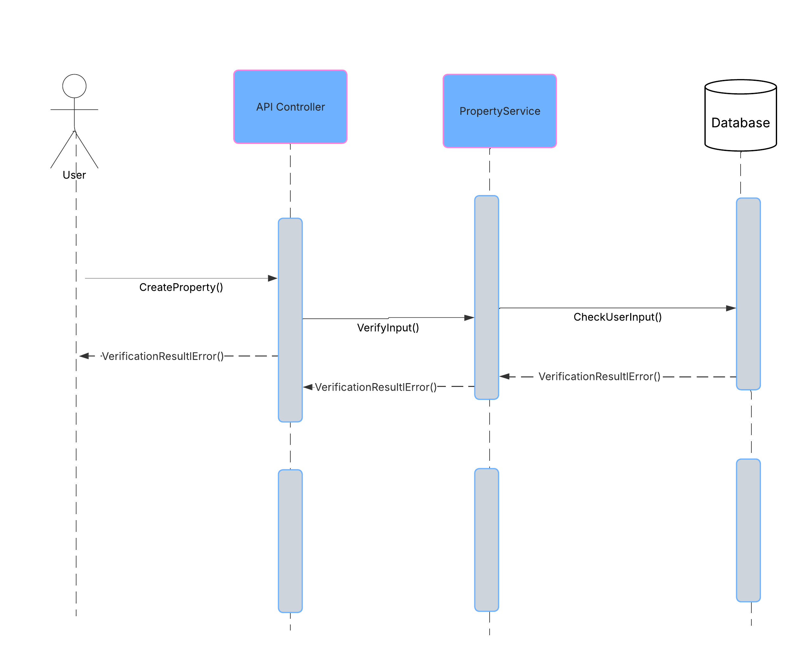

# holbertonschool-hbnb 

# 🚀 HBnB Evolution
a simplified version of an AirBnB-like application

## 📚 Table of Contents
- About
- High-Level Package Diagram
- Business Logic Layer
- Sequence Diagrams for API Calls

## 🧠 About
The HBnB Evolution project is a simplified, modular AirBnB-like platform designed to manage properties, users, amenities, and reviews in a structured and scalable architecture. The goal of HBnB Evolution is to build a platform that allows users to manage rental properties, share reviews, and associate amenities with listed places. 

Users can register as guests or administrators, create and manage property listings, and provide feedback in the form of reviews. The application is structured to support CRUD operations for Users, Places, Amenities, and Reviews, while enforcing essential business rules such as ownership, relationships, and audit tracking.

This documentation covers:
A high-level overview of system architecture using a layered approach.
Detailed business logic design through class diagrams.
Interaction modeling through sequence diagrams for core API operations.
By clearly defining the responsibilities and interactions of each component, this documentation will guide the engineering team in implementing a maintainable and extendable system that aligns with clean architectural principles such as separation of concerns and single responsibility.

## 🗂️ High-Level Package Diagram
Overview
The HBnB Evolution application is a structured around a three-layer architecture:

Presentation Layer
Purpose: This is the interface between users and the system.

Business Logic Layer
Purpose: Central hub for application logic and domain rules.

Persistence Layer
Purpose: Abstracts all direct interactions with the database.

Communication between the layers leverages the: 
Facade Pattern (Presentation Layer and Business Logic Layer)
Database Operations (Business Logic and Persistence layers)

## 🗃️Business Logic Layer

User
This entity represents a registered user of the system, which can be either a customer or admin. 

Attributes
Id: Unique identifier
First_name: first name of the user
Last_name: last name of the user
Email: registered email for authentication
Password: password used for authentication
Admin: A boolean which is used to determine if the user is an admin or not
Created: Timestamp of when the user was created
Updated: Timestamp of when the user was last updated

	
    Methods
init(...): Initializes a User object
create(...): Allows for the creation of a new User
update(): Updates the information regarding a User
delete(): Removes a User from the system

Relationships
One User can have many Places
One User can write many Reviews

	
Review
	
The entity represents a review that a User is able to leave on a place.

Attributes
Id: Unique identifier
Place: The place the review is left on
User: The user who is leaving the review
Comment: What the User would like the share about their experience
Created: Timestamp of when the review was created
Updated: Timestamp of when the review was last updated

	Methods
init(...): Initializes a Review object
create(...): Allows for the creation of a new Review 
update(): Updates the Review
delete(): Removes a Review from the system
show(): Lists all reviews of a place

	Relationships
A Review is left by a User
A Review is left on a Place

Place
		
	
The Place entity represents a property listing that a User is able to interact with.
	
Attributes
Id: unique identifier
Title: name of a listed properly
Description: Information regarding the Place
Price: How much the Place will cost to hire
Latitude/Longitude: Geographical coordinates of the location
Owner: The User that is the landlord of the property
Amenities: A list of amenities that you can expect to find at this location
Created: Timestamp of when the Place was created
Updated: Timestamp of when the Place was last updated

Methods
init(...): Initializes a Place object
create(...): Allows for the creation of a new Place 
update(): Updates the Place 
delete(): Removes a Place from the system
show(): Lists all reviews of a Place

	Relationships
A Place has a User
A Place can have many Reviews
A Place can have many Amenities

Amenity
	
The Amenity entity represents a feature or facility that a renter can expect to find a Place that they choose to hire.

Attributes
id : Unique identifier
Name: The name used to define the amenity
description : Brief sentence or paragraph to provide information on the facility or service
Created: Timestamp of when the Amenity was created
Updated: Timestamp of when the Amenity was last updated

Methods
init(...): Initializes a Amenity object
create(...): Allows for the creation of a new Amenity 
update(): Updates the Amenity 
delete(): Removes a Amenity from the system
show(): Lists all reviews of a Amenity
	
Relationships

Many Amenities can be part of a Place

##📬 API Interaction Flow
The purpose of these diagrams is to illustrate how the API calls interact with different HBnB applications - Presentation, Business logic and Persistence layers. It helps to demonstrate how different components interact with each other to help with user requests and clarify responsibilities across the systems.

User registration Diagram
This is to demonstrate how the end to end flow when a user signs up for an account.

Key components includes
User - started the request
UserRegistration - business logic for user registration
API controller - it handles the HTTP request
Database - store the user data

Design decisions and their rationale - it forms the base of user id and session management, and established the standard communication pattern for all the created operations.

Place Creation Diagram
This is to show how a login user creates a new property listing.

Key components includes
User - submits the property data
API controller - it forward to the PropertyService
PropertyService - check for user authorization and validity
Database - data is saved and response is returned.

Design decisions and their rationale - it demonstrated how new resources are created.

Review Submission Diagram
This is to show how users can submit reviews for existing properties

Key components includes
User - send review data with API
API controller - Validates requests and checks if the property exists.
ReviewService - the review object is created 
Database - data is saved and a confirmation is returned to the user.

Design decisions and their rationale - it supports the feedback from users to the property listing. 

Fetching a List of Places
This is to show the flow when the user requests a list of filtered available properties.

Key components  includes
User - sends a search request to the API
API controller - the controllers forwards the request to the PropertyService
PropertyService - retrieved the matching properties from the database
Database - the results are sent back to the user.

Design decisions and their rationale - the query-based interaction helps with the discoverability and user to find the correct properties efficiently. 

Summary for sequence diagrams
These diagrams help to clarify the relationship between three layers - Presentation, Business Logic and Persistence using Facade Pattern at the service layer. The different component has single responsibility and a defined role. 

##👨‍💻👩‍💻Developed By:
Jonathan Charalambous
Sophie 
Ying Tai
Eli Malana

