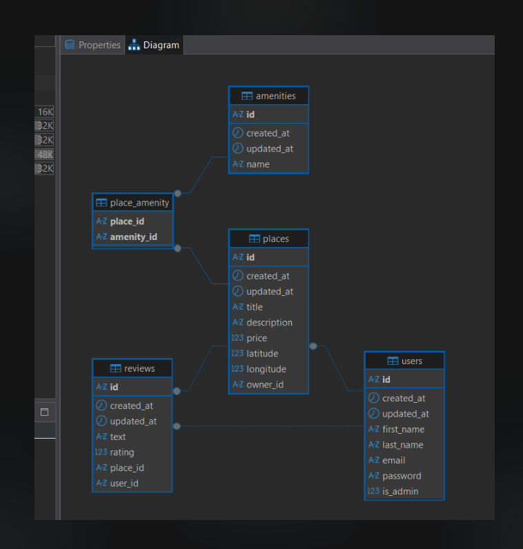

# 🚀 Part 3 

## 📝 Instructions
### 🖥️ Running the App 

```python3 run.py```  


## 🗄️ Database & Relationship 
### Entity-Relationship Diagram



🧱 Our entities are 
* 👤 User
* 🏠 Place
* ✍️ Review 
* 🛁 Amenity  


The following are the relationships between the entities:
* User and Place (One-to-Many): A User can create many Places, but each Place is associated with only one User.

* Place and Review (One-to-Many): A Place can have many Reviews, but each Review is associated with only one Place.

* User and Review (One-to-Many): A User can write many Reviews, but each Review is written by one User.

* Place and Amenity (Many-to-Many): A Place can have many Amenities, and an Amenity can be associated with many Places.


### Launching the Server & Database 
Change Sql credentials to own machine
Python3 run.py to start up the server
Start up Mysql server 
Start up Flask Shell to db.createall 
 